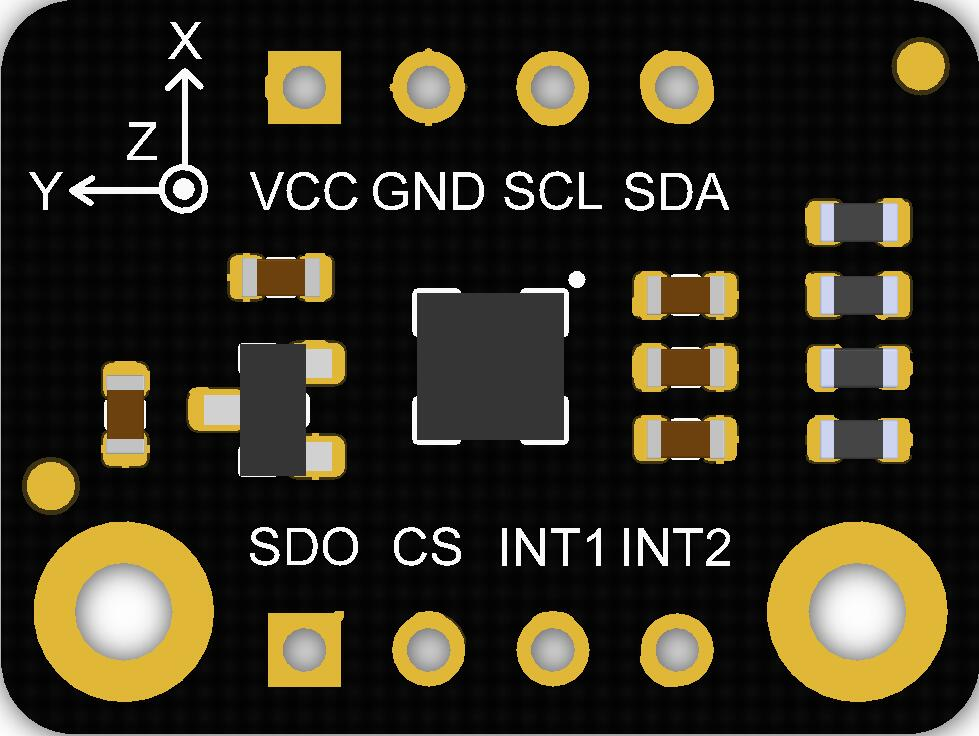

# DFRobot_LIS

* [中文版](./README_CN.md)
  
The H3LIS200DL is a low-power high performance 3-axis linear accelerometer 
belonging to the “nano” family, with digital I2C/SPI 
serial interface standard output. <br>
The device features ultra-low-power operational 
modes that allow advanced power saving and 
smart sleep-to-wakeup functions.<br>
The H3LIS200DL has dynamically user selectable full scales of ±100g/±200g and is 
capable of measuring accelerations with output 
data rates from 0.5 Hz to 1 kHz.<br>
The H3LIS200DL is available in a small thin 
plastic land grid array package (LGA) and is 
guaranteed to operate over an extended 
temperature range from -40 °C to +85 °C.<br>

The LIS331HH is an ultra low-power high 
performance high full-scale three axes linear 
accelerometer belonging to the “nano” family, with 
digital I2C/SPI serial interface standard output. 
The device features ultra low-power operational 
modes that allow advanced power saving and 
smart sleep to wake-up functions. 
The LIS331HH has dynamically user selectable 
full scales of ±6g/±12g/±24g and it is capable of 
measuring accelerations with output data rates 
from 0.5 Hz to 1 kHz. The self-test capability 
allows the user to check the funct

The IIS2DLPC is an ultra-low-power high-performance 
three-axis linear accelerometer with digital I²C/SPI 
output interface which leverages on the robust and 
mature manufacturing processes already used for the 
production of micromachined accelerometers.<br>
The IIS2DLPC has user-selectable full scales of 
±2g/±4g/±8g/±16g and is capable of measuring 
accelerations with output data rates from 1.6 Hz to 
1600 Hz.<br>

The LIS2DW12 is an ultra-low-power high-performance three-axis linear
accelerometer belonging to the “femto” family which leverages on the robust and
mature manufacturing processes already used for the production of micromachined
accelerometers.
The LIS2DW12 has user-selectable full scales of ±2g/±4g/±8g/±16g and is capable of
measuring accelerations with output data rates from 1.6 Hz to 1600 Hz.

CHIP                | Work Well    | Work Wrong  | Remarks
------------------  | :----------: | :---------- | -----
H3LIS200DL          |      √       |              |             
LIS331HH            |      √       |              |  
LIS2DW12            |      √       |              |             
IIS2DLPC            |      √       |              |  
IIS2DH12            |      √       |              |             





## Product Link(https://www.dfrobot.com)
    SKU:SEN0405
    SKU:SEN0407
    SKU:SEN0408
    SKU:SEN0409
    SKU:SEN0411
    SKU:SEN0412
    SKU:SEN0224

## Table of Contents

  * [Summary](#summary)
  * [Installation](#installation)
  * [Method_H3LIS200DL_LIS331HH](#Method_H3LIS200DL_LIS331HH)
  * [Method_LIS2DW12_IIS2DLPC](#Method_LIS2DW12_IIS2DLPC)
  * [Method_LIS2DH12](#Method_LIS2DH12)
  * [Compatibility](#compatibility)
  * [History](#history)
  * [Credits](#credits)

## Summary

Provide an Arduino library to get Three-axis acceleration by reading data from LIS.

## Installation

To use this library, first download the library file, paste it into the \Arduino\libraries directory, then open the examples folder and run the demo in the folder.

## Method_H3LIS200DL_LIS331HH 
```C++
  /**
   * @fn begin
   * @brief Initialize the function
   * @return true(Succeed)/false(Failed)
   */
  bool begin(void);
 
  /**
   * @fn getID
   * @brief Get chip id
   * @return 8 bit serial number
   */
  uint8_t getID();
  
  /**
   * @fn enableInterruptEvent
   * @brief Enable interrupt
   * @param source Interrupt pin selection
   * @n            eINT1 = 0,/<int1 >/
   * @n            eINT2,/<int2>/
   * @param event Interrupt event selection
   * @n           eXLowerThanTh ,/<The acceleration in the x direction is less than the threshold>/
   * @n           eXHigherThanTh ,/<The acceleration in the x direction is greater than the threshold>/
   * @n           eYLowerThanTh,/<The acceleration in the y direction is less than the threshold>/
   * @n           eYHigherThanTh,/<The acceleration in the y direction is greater than the threshold>/
   * @n           eZLowerThanTh,/<The acceleration in the z direction is less than the threshold>/
   * @n           eZHigherThanTh,/<The acceleration in the z direction is greater than the threshold>/
   */
  void enableInterruptEvent(eInterruptSource_t source, eInterruptEvent_t event);
  
  /**
   * @fn setRange
   * @brief Set measurement range
   * @param range Range(g)
   * @n           eH3lis200dl_100g, //±100g
   * @n           eH3lis200dl_200g, //±200g
   *                
   * @n            eLis331hh_6g = 6,//±6g
   * @n            eLis331hh_12g = 12 //±12g
   * @n            eLis331hh_24g = 24 //±24g  
   * @return true(Set successfully)/false(Set failed)
   */
  bool setRange(eRange_t range);
  
  /**
   * @fn setAcquireRate
   * @brief Set data measurement rate
   * @param rate rate(HZ)
   * @n          ePowerDown_0HZ   //Measurement off
   * @n          eLowPower_halfHZ //0.5 hz
   * @n          eLowPower_1HZ
   * @n          eLowPower_2HZ
   * @n          eLowPower_5HZ
   * @n          eLowPower_10HZ
   * @n          eNormal_50HZ
   * @n          eNormal_100HZ
   * @n          eNormal_400HZ
   * @n          eNormal_1000HZ
   */
  void setAcquireRate(ePowerMode_t rate);
  
  /**
   * @fn setHFilterMode
   * @brief Set data filtering mode
   * @param mode Four modes
   * @n          eCutOffMode1 = 0,
   * @n          eCutOffMode2,
   * @n          eCutOffMode3,
   * @n          eCutOffMode4,
   * @n          eShutDown, no filering
   * @n   eg: Select eCutOffMode1 in 50HZ, and the filtered frequency is 1HZ
   * @n |---------------------------High-pass filter cut-off frequency configuration-----------------------------|
   * @n |--------------------------------------------------------------------------------------------------------|
   * @n |                |    ft [Hz]      |        ft [Hz]       |       ft [Hz]        |        ft [Hz]        |
   * @n |   mode         |Data rate = 50 Hz|   Data rate = 100 Hz |  Data rate = 400 Hz  |   Data rate = 1000 Hz |
   * @n |--------------------------------------------------------------------------------------------------------|
   * @n |  eCutOffMode1  |     1           |         2            |            8         |             20        |
   * @n |--------------------------------------------------------------------------------------------------------|
   * @n |  eCutOffMode2  |    0.5          |         1            |            4         |             10        |
   * @n |--------------------------------------------------------------------------------------------------------|
   * @n |  eCutOffMode3  |    0.25         |         0.5          |            2         |             5         |
   * @n |--------------------------------------------------------------------------------------------------------|
   * @n |  eCutOffMode4  |    0.125        |         0.25         |            1         |             2.5       |
   * @n |--------------------------------------------------------------------------------------------------------|
   */
  void setHFilterMode(eHighPassFilter_t mode);

  /**
   * @fn setInt1Th
   * @brief Set the threshold of interrupt source 1 interrupt
   * @param threshold The threshold we set before is within measurement range(unit:g)
   */
  void setInt1Th(uint8_t threshold);

  /**
   * @fn setInt2Th
   * @brief Set interrupt source 2 interrupt generation threshold
   * @param threshold The threshold we set before is within measurement range(unit:g）
   */
  void setInt2Th(uint8_t threshold);

  /**
   * @fn enableSleep
   * @brief Enable sleep wake function
   * @param enable true(enable)\false(disable)
   * @return false Indicate enable failed/true Indicate enable successful
   */
  bool enableSleep(bool enable);
  
  /**
   * @fn getInt1Event
   * @brief Check whether the interrupt event'event' is generated in interrupt 1
   * @param event Interrupt event
   * @n           eXLowerThanTh ,/<The acceleration in the x direction is less than the threshold>/
   * @n           eXHigherThanTh ,/<The acceleration in the x direction is greater than the threshold>/
   * @n           eYLowerThanTh,/<The acceleration in the y direction is less than the threshold>/
   * @n           eYHigherThanTh,/<The acceleration in the y direction is greater than the threshold>/
   * @n           eZLowerThanTh,/<The acceleration in the z direction is less than the threshold>/
   * @n           eZHigherThanTh,/<The acceleration in the z direction is greater than the threshold>/
   * @return true This event generated/false This event not generated
   */
  bool getInt1Event(eInterruptEvent_t event);

  /**
   * @fn getInt2Event
   * @brief Check whether the interrupt event'event' is generated in interrupt 2
   * @param event Interrupt event
   * @n           eXLowerThanTh ,/<The acceleration in the x direction is less than the threshold>/
   * @n           eXHigherThanTh ,/<The acceleration in the x direction is greater than the threshold>/
   * @n           eYLowerThanTh,/<The acceleration in the y direction is less than the threshold>/
   * @n           eYHigherThanTh,/<The acceleration in the y direction is greater than the threshold>/
   * @n           eZLowerThanTh,/<The acceleration in the z direction is less than the threshold>/
   * @n           eZHigherThanTh,/<The acceleration in the z direction is greater than the threshold>/
   * @return true This event generated/false This event not generated
   */
  bool getInt2Event(eInterruptEvent_t event);
  
  /**
   * @fn readAccX
   * @brief Get the acceleration in the x direction
   * @return acceleration from x 
   */
  int32_t readAccX();
  
  /**
   * @fn readAccY
   * @brief Get the acceleration in the y direction
   * @return acceleration from y
   */
  int32_t readAccY();
  
  /**
   * @brief Get the acceleration in the z direction
   * @return acceleration from z
   */
  int32_t readAccZ();
  
  /**
   * @fn getAcceFromXYZ
   * @brief Get the acceleration in the three directions of xyz
   * @param accx Store the variable of acceleration in x direction
   * @param accy Store the variable of acceleration in y direction
   * @param accz Store the variable of acceleration in z direction
   * @return true(Get data successfully/false(Data not ready)
   */
  bool getAcceFromXYZ(int32_t &accx,int32_t &accy,int32_t &accz);

  /**
   * @fn getSleepState
   * @brief Get whether the sensor is in sleep mode
   * @return true(In sleep mode)/false(In normal mode)
   */
  bool getSleepState();
  
  /**
   * @fn setSleepFlag
   * @brief Set the sleep state flag
   * @param into true(Flag the current mode as sleep mode)/false(Flag the current mode as normal mode)
   */
  void setSleepFlag(bool into);
```
## Method_LIS2DW12_IIS2DLPC
```C++
  /**
   * @fn begin
   * @brief Initialize the function
   * @return true(Initialization succeed)/fasle(Initialization failed)
   */
  bool begin(void);
 
  /**
   * @fn getID
   * @brief Get chip id
   * @return 8 bit serial number
   */
  uint8_t getID();
 
  /**
   * @fn softReset
   * @brief Software reset to restore the value of all registers to the default value
   */
  void softReset();
  
  /**
   * @fn continRefresh
   * @brief Enable the chip to continuously collect data
   * @param enable  true(continuous update)/false( output registers not updated until MSB and LSB read)
   */
  void continRefresh(bool enable);
  
  /**
   * @fn setFilterPath
   * @brief Set the filter processing mode
   * @param path path of filtering
   * @n          eLPF   = 0x00,/< low-pass filter path selected>/
   * @n          eHPF   = 0x10,/<high-pass filter path selected>/
   */
  void setFilterPath(ePath_t path);

  /**
   * @fn setFilterBandwidth
   * @brief Set the  bandwidth of the data
   * @param bw bandwidth
   * @n        eRateDiv_2  ,/<Rate/2 (up to Rate = 800 Hz, 400 Hz when Rate = 1600 Hz)>/
   * @n        eRateDiv_4  ,/<Rate/4 (High Power/Low power)>*
   * @n        eRateDiv_10 ,/<Rate/10 (HP/LP)>/
   * @n        eRateDiv_20 ,/<Rate/20 (HP/LP)>/
   */
  void setFilterBandwidth(eBWFilter_t bw);
  
  /**
   * @fn setPowerMode
   * @brief Set power mode, there are two modes for the sensor to measure acceleration
   * @n       1.Continuous measurement In this mode, the sensor will continuously measure and store data in its register
   * @n       2.Single data conversion on demand mode In this mode, the sensor will not make a measurement unless it receives an external request
   * @param mode  power modes to choose from
   * @n           eHighPerformance_14bit         /<High-Performance Mode,14-bit resolution>/
   * @n           eContLowPwr4_14bit             /<Continuous measurement,Low-Power Mode 4(14-bit resolution)>/
   * @n           eContLowPwr3_14bit             /<Continuous measurement,Low-Power Mode 3(14-bit resolution)>/
   * @n           eContLowPwr2_14bit             /<Continuous measurement,Low-Power Mode 2(14-bit resolution)/
   * @n           eContLowPwr1_12bit             /<Continuous measurement,Low-Power Mode 1(12-bit resolution)>/
   * @n           eSingleLowPwr4_14bit           /<Single data conversion on demand mode,Low-Power Mode 4(14-bit resolution)>/
   * @n           eSingleLowPwr3_14bit           /<Single data conversion on demand mode,Low-Power Mode 3(14-bit resolution)>/
   * @n           eSingleLowPwr2_14bit           /<Single data conversion on demand mode,Low-Power Mode 2(14-bit resolution)>/
   * @n           eSingleLowPwr1_12bit           /<Single data conversion on demand mode,Low-Power Mode 1(12-bit resolution)>/
   * @n           eHighPerformanceLowNoise_14bit /<High-Performance Mode,Low-noise enabled,14-bit resolution>/
   * @n           eContLowPwrLowNoise4_14bit     /<Continuous measurement,Low-Power Mode 4(14-bit resolution,Low-noise enabled)>/
   * @n           eContLowPwrLowNoise3_14bit     /<Continuous measurement,Low-Power Mode 3(14-bit resolution,Low-noise enabled)>/
   * @n           eContLowPwrLowNoise2_14bit     /<Continuous measurement,Low-Power Mode 2(14-bit resolution,Low-noise enabled)>/
   * @n           eContLowPwrLowNoise1_12bit     /<Continuous measurement,Low-Power Mode 1(12-bit resolution,Low-noise enabled)>/
   * @n           eSingleLowPwrLowNoise4_14bit   /<Single data conversion on demand mode,Low-Power Mode 4(14-bit resolution),Low-noise enabled>/
   * @n           eSingleLowPwrLowNoise3_14bit   /<Single data conversion on demand mode,Low-Power Mode 3(14-bit resolution),Low-noise enabled>/
   * @n           eSingleLowPwrLowNoise2_14bit   /<Single data conversion on demand mode,Low-Power Mode 2(14-bit resolution),Low-noise enabled>/
   * @n           eSingleLowPwrLowNoise1_12bit   /<Single data conversion on demand mode,Low-Power Mode 1(12-bit resolution),Low-noise enabled>/
   */
  void setPowerMode(ePowerMode_t mode);
  
  /**
   * @fn setDataRate
   * @brief Chip data collection rate setting
   * @param rate  Accelerometer frequency, 0-1600hz selection
   * @n           eRate_0hz            /<Measurement off>/
   * @n           eRate_1hz6           /<1.6hz, use only under low-power mode>/
   * @n           eRate_12hz5          /<12.5hz>/
   * @n           eRate_25hz        
   * @n           eRate_50hz        
   * @n           eRate_100hz       
   * @n           eRate_200hz       
   * @n           eRate_400hz         /<Use only under High-Performance mode>/
   * @n           eRate_800hz         /<Use only under High-Performance mode>/
   * @n           eRate_1k6hz         /<Use only under High-Performance mode>/
   * @n           eSetSwTrig          /<The software triggers a single measurement>/
   */
  void setDataRate(eRate_t rate);
  
  /**
   * @fn setFreeFallDur
   * @brief Set the free fall time, or the number of free-fall samples. In a measurement, it will not be determined as a free fall event 
   * @n     unless the samples are enough.
   * @param dur Freefall samples, range：0~31
   * @n time = dur * (1/rate)(unit:s)
   * @n  |                            An example of a linear relationship between an argument and time                            |
   * @n  |------------------------------------------------------------------------------------------------------------------------|
   * @n  |                |                     |                          |                          |                           |
   * @n  |  Data rate     |       25 Hz         |         100 Hz           |          400 Hz          |         = 800 Hz          |
   * @n  |------------------------------------------------------------------------------------------------------------------------|
   * @n  |   time         |dur*(1s/25)= dur*40ms|  dur*(1s/100)= dur*10ms  |  dur*(1s/400)= dur*2.5ms |  dur*(1s/800)= dur*1.25ms |
   * @n  |------------------------------------------------------------------------------------------------------------------------|
   */
  void setFreeFallDur(uint8_t dur);
  
  /**
   * @fn setInt1Event
   * @brief Select the interrupt event generated on the int1 pin
   * @param event  Interrupt event, when it occurs, a level jump will be generated on the int1 pin
   * @n            eDoubleTap    = 0x08,/<Double tap event>/
   * @n            eFreeFall     = 0x10,/<Free-fall event>/
   * @n            eWakeUp       = 0x20,/<Wake-up event>/
   * @n            eSingleTap    = 0x40,/<Single tap event>/
   * @n            e6D           = 0x80,/<An event that changes the status of facing up/down/left/right/forward/back>/
   */
  void setInt1Event(eInt1Event_t event);
  
  /**
   * @fn setInt2Event
   * @brief Select the interrupt event generated on the int2 pin
   * @param event Interrupt event, when it occurs, a level jump will be generated on the int2 pin
   * @n           eSleepChange = 0x40,/<Sleep change status routed to INT2 pad>/
   * @n           eSleepState  = 0x80,/<Enable routing of SLEEP_STATE on INT2 pad>/
   */
  void setInt2Event(eInt2Event_t event);
  
  /**
   * @fn setWakeUpDur
   * @brief Set wake-up duration, when using the detection mode of eDetectAct in setActMode() function, it will collect data at a normal rate
   * @n     after the chip is awakened. Then after a period of time, the chip will continue to hibernate, collecting data at a frequency of 
   * @n     12.5hz.
   * @param dur duration,range: 0~3
   * @n time = dur * (1/rate)(unit:s)
   * @n  |                           An example of a linear relationship between an argument and time                             |
   * @n  |------------------------------------------------------------------------------------------------------------------------|
   * @n  |                |                     |                          |                          |                           |
   * @n  |  Data rate     |       25 Hz         |         100 Hz           |          400 Hz          |         = 800 Hz          |
   * @n  |------------------------------------------------------------------------------------------------------------------------|
   * @n  |   time         |dur*(1s/25)= dur*40ms|  dur*(1s/100)= dur*10ms  |  dur*(1s/400)= dur*2.5ms |  dur*(1s/800)= dur*1.25ms |
   * @n  |------------------------------------------------------------------------------------------------------------------------|
   */
  void setWakeUpDur(uint8_t dur);

  /**
   * @fn setWakeUpThreshold
   * @brief Set the wake-up threshold, when the acceleration in a certain direction is greater than this value, a wake-up event will be triggered
   * @param th threshold ,unit:mg, the value is within the measurement range
   */
  void setWakeUpThreshold(float th);
  
  /**
   * @fn setActMode
   * @brief Set the mode of motion detection, the first mode will not detect whether the module is moving; the second, once set, will measure data at a lower 
   * @n frequency to save consumption, and return to normal after detecting motion; the third can only detect whether the module is in sleep 
   * @n state.
   * @param mode Motion detection mode
   * @n          eNoDetection         /<No detection>/
   * @n          eDetectAct           /<Detect movement,the chip automatically goes to 12.5 Hz rate in the low-power mode>/
   * @n          eDetectStatMotion    /<Detect Motion, the chip detects acceleration below a fixed threshold but does not change either rate or operating mode>/
   */
  void setActMode(eActDetect_t mode);
  
  /**
   * @fn setRange
   * @brief Set the range
   * @param range 量程
   * @n              eLIS2DH12_2g /<±2g>/
   * @n              eLIS2DH12_4g /<±4g>/
   * @n              eLIS2DH12_8g /<±8g>/
   * @n              eLIS2DH12_16g /<±16g>/
   */
  void setRange(eRange_t range);
  
  /**
   * @fn enableTapDetectionOnZ
   * @brief Enable detect tap events in the Z direction
   * @param enable ture(Enable tap detection)\false(Disable tap detection)
   */
  void enableTapDetectionOnZ(bool enable);
  
  /**
   * @fn enableTapDetectionOnY
   * @brief Enable detect tap events in the Y direction
   * @param enable ture(Enable tap detection)\false(Disable tap detection)
   */
  void enableTapDetectionOnY(bool enable);

  /**
   * @fn enableTapDetectionOnX
   * @brief Enable detect tap events in the X direction
   * @param enable ture(Enable tap detection)\false(Disable tap detection)
   */
  void enableTapDetectionOnX(bool enable);

  /**
   * @fn setTapThresholdOnX
   * @brief Set the tap threshold in the X direction
   * @param th Threshold(mg),Can only be used in the range of 0~2g
   */
  void setTapThresholdOnX(float th);
  
  /**
   * @fn setTapThresholdOnY
   * @brief Set the tap threshold in the Y direction
   * @param th Threshold(mg),Can only be used in the range of 0~2g
   */
  void setTapThresholdOnY(float th);

  /**
   * @fn setTapThresholdOnZ
   * @brief Set the tap threshold in the Z direction
   * @param th Threshold(mg),Can only be used in the range of 0~2g
   */
  void setTapThresholdOnZ(float th);
  
  /**
   * @fn setTapDur
   * @brief Duration of maximum time gap for double-tap recognition. When double-tap 
   * @n recognition is enabled, this register expresses the maximum time between two 
   * @n successive detected taps to determine a double-tap event.
   * @param dur duration, range:0~15
   * @n time = dur * (1/rate)(unit:s)
   * @n  |                        An example of a linear relationship between an argument and time                                |
   * @n  |------------------------------------------------------------------------------------------------------------------------|
   * @n  |                |                     |                          |                          |                           |
   * @n  |  Data rate     |       25 Hz         |         100 Hz           |          400 Hz          |         = 800 Hz          |
   * @n  |------------------------------------------------------------------------------------------------------------------------|
   * @n  |   time         |dur*(1s/25)= dur*40ms|  dur*(1s/100)= dur*10ms  |  dur*(1s/400)= dur*2.5ms |  dur*(1s/800)= dur*1.25ms |
   * @n  |------------------------------------------------------------------------------------------------------------------------|
   */
  void setTapDur(uint8_t dur);
  
  /**
   * @fn setTapMode
   * @brief Set the tap detection mode, detect single tap or both single tap and double tap 
   * @param mode Tap detection mode
   * @n          eOnlySingle   /<Detect single tap>/
   * @n          eBothSingleDouble /<Detect both single tap and double tap>/
   */
  void setTapMode(eTapMode_t mode);

  /**
   * @fn set6DThreshold
   * @brief Set Thresholds for 4D/6D, when the threshold of rotation exceeds the specified angle, a direction change event 
   * @n     will occur.
   * @param degree   eDegrees80   /<80°>/
   * @n              eDegrees70   /<70°>/
   * @n              eDegrees60   /<60°>/
   * @n              eDegrees50   /<50°>/
   */
  void set6DThreshold(e6DTh_t degree);

  /**
   * @fn readAccX
   * @brief Read the acceleration in the x direction
   * @return  Acceleration data from x(mg), the measurement range is ±2g, ±4g, ±8g or ±16g, set by the setRange() funciton.
   */
  int16_t readAccX();
  
  /**
   * @fn readAccY
   * @brief Read the acceleration in the y direction
   * @return  Acceleration data from y(mg), the measurement range is ±2g, ±4g, ±8g or ±16g, set by the setRange() funciton.
   */
  int16_t readAccY();
  
  /**
   * @fn readAccZ
   * @brief Read the acceleration in the z direction
   * @return  Acceleration data from z(mg), the measurement range is ±2g, ±4g, ±8g or ±16g, set by the setRange() funciton.
   */
  int16_t readAccZ();
  
  /**
   * @fn actDetected
   * @brief Detect motion
   * @return true(Motion generated)/false(No motion)
   */
  bool actDetected();
  
  /**
   * @fn freeFallDetected
   * @brief Detect free fall 
   * @return true(Free-fall detected)/false(No free-fall)
   */
  bool freeFallDetected();
  
  /**
   * @fn oriChangeDetected
   * @brief Detect whether the direction of the chip changes when the chip is facing up/down/left/right/forward/back (ie 6D)
   * @return true(a change in position detected)/false(no event detected)
   */
  bool oriChangeDetected();
  
  /**
   * @fn getOrientation
   * @brief Only in 6D (facing up/down/left/right/forward/backward) state can the function get the orientation of the 
   * @n sensor relative to the positive z-axis.
   * @return    eXDown  /<X is now down>/
   * @n         eXUp    /<X is now up>/
   * @n         eYDown  /<Y is now down>/
   * @n         eYUp    /<Y is now up>/
   * @n         eZDown  /<Z is now down>/
   * @n         eZUp    /<Z is now up>/
   */
  eOrient_t getOrientation();
  
  /**
   * @fn tapDetect
   * @brief Tap detection, can detect it is double tap or single tap
   * @return   eSTap       /<Single Tap>/
   * @n        eDTap       /<double Tap>/
   * @n        eNoTap,     //No tap 
   */
  eTap_t tapDetect();
  
  /**
   * @fn getTapDirection
   * @brief Tap direction source detection
   * @return   eDirXUp   /<Tap is detected in the positive direction of X>/
   * @n        eDirXDown /<Tap is detected in the negative direction of X>/
   * @n        eDirYUp   /<Tap is detected in the positive direction of Y>/
   * @n        eDirYDown /<Tap is detected in the negative direction of Y>/
   * @n        eDirZUp   /<Tap is detected in the positive direction of Z>/
   * @n        eDirZDown /<Tap is detected in the negative direction of Z>/
   */
  eTapDir_t getTapDirection();
  
  /**
   * @fn getWakeUpDir
   * @brief Wake-up motion direction detection
   * @return   eDirX    /<The chip is woken up by the motion in X direction>/
   * @n        eDirY    /<The chip is woken up by the motion in Y direction>/
   * @n        eDirZ    /<The chip is woken up by the motion in Z direction>/
   * @n        eDirError,/<Error detected>/
   */
  eWakeUpDir_t getWakeUpDir();
  
  /**
   * @fn demandData
   * @brief In Single data conversion on demand mode, request a measurement.
   */
  void demandData();
```
## Method_LIS2DH12
```C++
 /**
  * @fn begin
  * @brief Initialize the function
  * @return true(Succeed)/false(Failed)
  */
  bool begin(void);

  /**
   * @fn setRange
   * @brief Set the measurement range
   * @param range Range(g)
   * @n           eLIS2DH12_2g, //±2g
   * @n           eLIS2DH12_4g, //4g
   * @n           eLIS2DH12_8g, //8g
   * @n           eLIS2DH12_16g, //16g
   * @return None
   */
  void setRange(eRange_t range);

  /**
   * @fn setAcquireRate
   * @brief Set data measurement rate
   * @param rate rate(HZ)
   * @n          ePowerDown_0Hz 
   * @n          eLowPower_1Hz 
   * @n          eLowPower_10Hz 
   * @n          eLowPower_25Hz 
   * @n          eLowPower_50Hz 
   * @n          eLowPower_100Hz
   * @n          eLowPower_200Hz
   * @n          eLowPower_400Hz
   */
  void setAcquireRate(ePowerMode_t rate);

  /**
   * @fn getID
   * @brief Get chip id
   * @return 8 bit serial number
   */
  uint8_t getID();

  /**
   * @fn readAccX
   * @brief Get the acceleration in the x direction
   * @return acceleration from x (unit:g), the mearsurement range is ±100g or ±200g, set by setRange() function.
   */
  int32_t readAccX();

  /**
   * @fn readAccY
   * @brief Get the acceleration in the y direction
   * @return acceleration from y(unit:g), the mearsurement range is ±100g or ±200g, set by setRange() function.
   */
  int32_t readAccY();

  /**
   * @fn readAccZ
   * @brief Get the acceleration in the z direction
   * @return acceleration from z(unit:g), the mearsurement range is ±100g or ±200g, set by setRange() function.
   */
  int32_t readAccZ();
  
  /**
   * @fn setInt1Th
   * @brief Set the threshold of interrupt source 1 interrupt
   * @param threshold The threshold is within the measurement range(unit:g)
   */
  void setInt1Th(uint8_t threshold);

  /**
   * @fn setInt2Th
   * @brief Set interrupt source 2 interrupt generation threshold
   * @param threshold The threshold is within the measurement range(unit:g）
   */
  void setInt2Th(uint8_t threshold);

  /**
   * @fn enableInterruptEvent
   * @brief Enable interrupt
   * @param source Interrupt pin selection
   * @n            eINT1 = 0,/<int1 >/
   * @n            eINT2,/<int2>/
   * @param event Interrupt event selection
   * @n           eXLowerThanTh ,/<The acceleration in the x direction is less than the threshold>/
   * @n           eXHigherThanTh ,/<The acceleration in the x direction is greater than the threshold>/
   * @n           eYLowerThanTh,/<The acceleration in the y direction is less than the threshold>/
   * @n           eYHigherThanTh,/<The acceleration in the y direction is greater than the threshold>/
   * @n           eZLowerThanTh,/<The acceleration in the z direction is less than the threshold>/
   * @n           eZHigherThanTh,/<The acceleration in the z direction is greater than the threshold>/
   */
  void enableInterruptEvent(eInterruptSource_t source, eInterruptEvent_t event);

  /**
   * @fn getInt1Event
   * @brief Check whether the interrupt event'event' is generated in interrupt 1
   * @param event Interrupt event
   * @n           eXLowerThanTh ,/<The acceleration in the x direction is less than the threshold>/
   * @n           eXHigherThanTh ,/<The acceleration in the x direction is greater than the threshold>/
   * @n           eYLowerThanTh,/<The acceleration in the y direction is less than the threshold>/
   * @n           eYHigherThanTh,/<The acceleration in the y direction is greater than the threshold>/
   * @n           eZLowerThanTh,/<The acceleration in the z direction is less than the threshold>/
   * @n           eZHigherThanTh,/<The acceleration in the z direction is greater than the threshold>/
   * @return true Generated/false Not generated
   */
  bool getInt1Event(eInterruptEvent_t event);

  /**
   * @fn getInt2Event
   * @brief Check whether the interrupt event'event' is generated in interrupt 1
   * @param event Interrupt event
   * @n           eXLowerThanTh ,/<The acceleration in the x direction is less than the threshold>/
   * @n           eXHigherThanTh ,/<The acceleration in the x direction is greater than the threshold>/
   * @n           eYLowerThanTh,/<The acceleration in the y direction is less than the threshold>/
   * @n           eYHigherThanTh,/<The acceleration in the y direction is greater than the threshold>/
   * @n           eZLowerThanTh,/<The acceleration in the z direction is less than the threshold>/
   * @n           eZHigherThanTh,/<The acceleration in the z direction is greater than the threshold>/
   * @return true Generated/false Not generated
   */
  bool getInt2Event(eInterruptEvent_t event);
```
## Compatibility

MCU                | Work Well    | Work Wrong   | Untested    | Remarks
------------------ | :----------: | :----------: | :---------: | -----
Arduino Uno        |      √       |              |             | 
FireBeetle-ESP8266 |      √       |              |             | 
FireBeetle-ESP32   |      √       |              |             | 
Arduino MEGA2560   |      √       |              |             | 
Arduino Leonardo   |      √       |              |             | 
Micro:bit          |      √       |              |             | 
FireBeetle-M0      |      √       |              |             | 
Raspberry Pi       |      √       |              |             | 

## History

- 2021/2/1 -1.0.0 version
- 2021/1/6 -1.0.1 version

## Credits

Written by(li.feng@dfrobot.com,jie.tang@dfrobot.com), 2020. (Welcome to our [website](https://www.dfrobot.com/))
