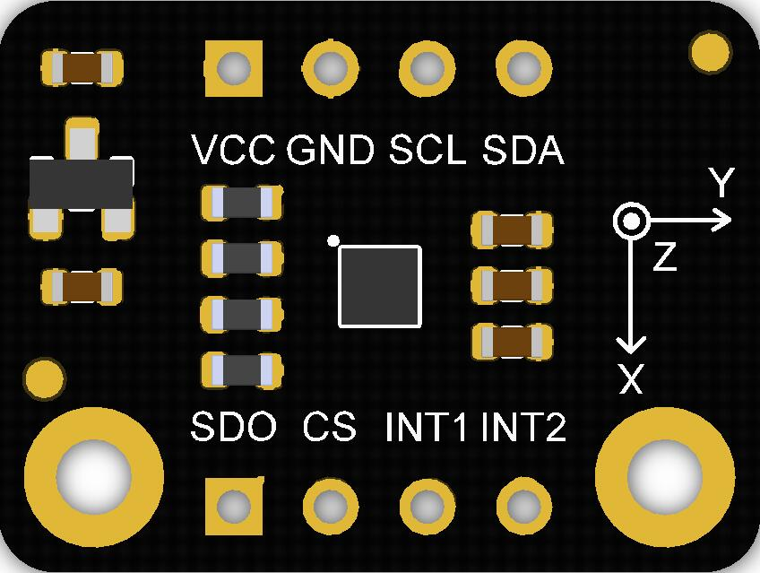
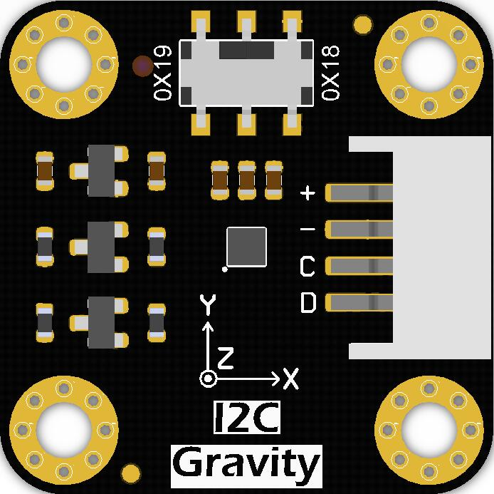
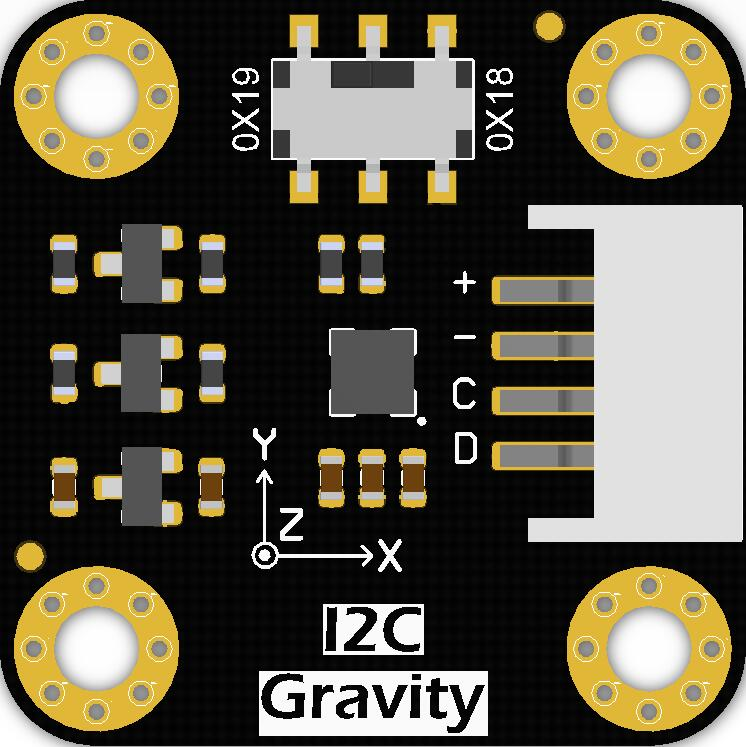

# DFRobot_LIS

* [中文版](./README_CN.md)

The H3LIS200DL is a low-power high performance 3-axis linear accelerometer 
belonging to the “nano” family, with digital I2C/SPI 
serial interface standard output. <br>
The device features ultra-low-power operational 
modes that allow advanced power saving and 
smart sleep-to-wakeup functions.<br>
The H3LIS200DL has dynamically user selectable full scales of ±100g/±200g and is 
capable of measuring accelerations with output 
data rates from 0.5 Hz to 1 kHz.<br>
The H3LIS200DL is available in a small thin 
plastic land grid array package (LGA) and is 
guaranteed to operate over an extended 
temperature range from -40 °C to +85 °C.<br>

The LIS331HH is an ultra low-power high 
performance high full-scale three axes linear 
accelerometer belonging to the “nano” family, with 
digital I2C/SPI serial interface standard output. 
The device features ultra low-power operational 
modes that allow advanced power saving and 
smart sleep to wake-up functions. 
The LIS331HH has dynamically user selectable 
full scales of ±6g/±12g/±24g and it is capable of 
measuring accelerations with output data rates 
from 0.5 Hz to 1 kHz. The self-test capability 
allows the user to check the funct

The IIS2DLPC is an ultra-low-power high-performance 
three-axis linear accelerometer with digital I²C/SPI 
output interface which leverages on the robust and 
mature manufacturing processes already used for the 
production of micromachined accelerometers.<br>
The IIS2DLPC has user-selectable full scales of 
±2g/±4g/±8g/±16g and is capable of measuring 
accelerations with output data rates from 1.6 Hz to 
1600 Hz.<br>

The LIS2DW12 is an ultra-low-power high-performance three-axis linear
accelerometer belonging to the “femto” family which leverages on the robust and
mature manufacturing processes already used for the production of micromachined
accelerometers.
The LIS2DW12 has user-selectable full scales of ±2g/±4g/±8g/±16g and is capable of
measuring accelerations with output data rates from 1.6 Hz to 1600 Hz.

CHIP                | Work Well    | Work Wrong  | Remarks
------------------  | :----------: | :----------| -----
H3LIS200DL          |      √       |              |             
LIS331HH            |      √       |              |   
LIS2DW12            |      √       |              |             
IIS2DLPC            |      √       |              |        








## Product Link(https://www.dfrobot.com)
    SKU:SEN0405
    SKU:SEN0407
    SKU:SEN0408
    SKU:SEN0409
    SKU:SEN0411
    SKU:SEN0412
    SKU:SEN0224

## Table of Contents

  * [Summary](#summary)
  * [Installation](#installation)
  * [Method_H3LIS200DL_LIS331HH](#Method_H3LIS200DL_LIS331HH)
  * [Method_LIS2DW12_IIS2DLPC](#Method_LIS2DW12_IIS2DLPC)
  * [Method_LIS2DH12](#Method_LIS2DH12)
  * [Compatibility](#compatibility)
  * [History](#history)
  * [Credits](#credits)

## Summary

Provide an Arduino library to get Three-axis acceleration by reading data from LIS.

## Installation

Download the DFRobot_LIS file to the Raspberry Pi file directory, then run the following command line to use this sensor:
```
cd DFRobot_LIS/python/raspberry/examples/LIS331HH/get_acceleration
python get_acceleration.py
```


## Method_H3LIS200DL_LIS331HH
```python
  def begin(self)
    '''
      @brief Initialize the function
      @return return True(Succeed)/False(Failed)
    '''
  
  def get_id(self)
    '''
      @brief get chip id
      @return 8 bit serial number
    '''
  
  def set_range(self,range_r)  
    '''
      @brief Set the measurement range
      @param range Range(g)
      @n            H3LIS200DL_100G = 100 #±100G
      @n            H3LIS200DL_200G = 200 #±200G
      @n            LIS331HH_6G     #±6G
      @n            LIS331HH_12G    #±12G
      @n            LIS331HH_24G    #±24G
    '''
  
  def set_acquire_rate(self, rate)
    '''
      @brief Set data measurement rate
      @param rate rate(HZ)
      @n            POWERDOWN_0HZ   
      @n            LOWPOWER_HALFHZ 
      @n            LOWPOWER_1HZ    
      @n            LOWPOWER_2HZ 
      @n            LOWPOWER_5HZ
      @n            LOWPOWER_10HZ 
      @n            NORMAL_50HZ
      @n            NORMAL_100HZ 
      @n            NORMAL_400HZ 
      @n            NORMAL_1000HZ 
    '''
  
  def set_int1_th(self,threshold)  
    '''
      @brief Set the threshold of interrupt source 1 interrupt
      @param threshold Threshold(g)
    '''
  
  def set_int2_th(self,threshold)  
    '''
      @brief Set interrupt source 2 interrupt generation threshold
      @param threshold Threshold(g)
    '''
  
  def enable_int_event(self,source,event)
    '''
      @brief Enable interrupt
      @source Interrupt pin selection
      @n        INT_1 = 0,/<int pad 1 >/
      @n        INT_2,/<int pad 2>/
      @param event Interrupt event selection
      @n        X_LOWERTHAN_TH     = 0x1<The acceleration in the x direction is less than the threshold>
      @n        X_HIGHERTHAN_TH  = 0x2<The acceleration in the x direction is greater than the threshold>
      @n        Y_LOWERTHAN_TH     = 0x4<The acceleration in the y direction is less than the threshold>
      @n        Y_HIGHERTHAN_TH  = 0x8<The acceleration in the y direction is greater than the threshold>
      @n        Z_LOWERTHAN_TH     = 0x10<The acceleration in the z direction is less than the threshold
      @n        Z_HIGHERTHAN_TH  = 0x20<The acceleration in the z direction is greater than the threshold>
      @n        EVENT_ERROR      = 0 <No event>
    '''
  
  def get_int1_event(self,event)
    '''
      @brief Check whether the interrupt event'event' is generated in interrupt 1
      @param event Interrupt event
      @n        X_LOWERTHAN_TH     = 0x1<The acceleration in the x direction is less than the threshold>
      @n        X_HIGHERTHAN_TH  = 0x2<The acceleration in the x direction is greater than the threshold>
      @n        Y_LOWERTHAN_TH     = 0x4<The acceleration in the y direction is less than the threshold>
      @n        Y_HIGHERTHAN_TH  = 0x8<The acceleration in the y direction is greater than the threshold>
      @n        Z_LOWERTHAN_TH     = 0x10<The acceleration in the z direction is less than the threshold
      @n        Z_HIGHERTHAN_TH  = 0x20<The acceleration in the z direction is greater than the threshold>
      @n        EVENT_ERROR      = 0 <No event>
      @return True ：The event is generated./False：The event is not generated.
    '''
  
  def get_int2_event(self,source)       
    '''
      @brief Check whether the interrupt event'event' is generated in interrupt 2
      @param event Interrupt event
      @n        X_LOWERTHAN_TH     = 0x1<The acceleration in the x direction is less than the threshold>
      @n        X_HIGHERTHAN_TH  = 0x2<The acceleration in the x direction is greater than the threshold>
      @n        Y_LOWERTHAN_TH     = 0x4<The acceleration in the y direction is less than the threshold>
      @n        Y_HIGHERTHAN_TH  = 0x8<The acceleration in the y direction is greater than the threshold>
      @n        Z_LOWERTHAN_TH     = 0x10<The acceleration in the z direction is less than the threshold
      @n        Z_HIGHERTHAN_TH  = 0x20<The acceleration in the z direction is greater than the threshold>
      @n        EVENT_ERROR      = 0 <No event>
      @return True ：The event is generated./False：The event is not generated.
    '''
  
  def enable_sleep(self, enable)
    '''
      @brief Enable sleep wake function
      @param enable True(enable)/False(disable)
    '''
  
  def set_filter_mode(self,mode)
    '''
      @brief Set data filtering mode
      @param mode Four modes
      @n            CUTOFF_MODE1 = 0
      @n            CUTOFF_MODE2 = 1
      @n            CUTOFF_MODE3 = 2
      @n            CUTOFF_MODE4 = 3
      @neg：Select eCutOffMode1 in 50HZ, and the filtered frequency is 1HZ
      @n                        High-pass filter cut-off frequency configuration
      @n|--------------------------------------------------------------------------------------------------------|
      @n|                |    ft [Hz]      |        ft [Hz]       |       ft [Hz]        |        ft [Hz]        |
      @n|   mode         |Data rate = 50 Hz|   Data rate = 100 Hz |  Data rate = 400 Hz  |   Data rate = 1000 Hz |
      @n|--------------------------------------------------------------------------------------------------------|
      @n|  CUTOFF_MODE1  |     1           |         2            |            8         |             20        |
      @n|--------------------------------------------------------------------------------------------------------|
      @n|  CUTOFF_MODE2  |    0.5          |         1            |            4         |             10        |
      @n|--------------------------------------------------------------------------------------------------------|
      @n|  CUTOFF_MODE3  |    0.25         |         0.5          |            2         |             5         |
      @n|--------------------------------------------------------------------------------------------------------|
      @n|  CUTOFF_MODE4  |    0.125        |         0.25         |            1         |             2.5       |
      @n|--------------------------------------------------------------------------------------------------------|
    '''
  
  def read_acce_xyz(self)  
    '''
      @brief Get the acceleration in the three directions of xyz
      @return Three-axis acceleration 
    '''
  

```

## Method_LIS2DW12_IIS2DLPC
```python
  def begin(self)
    '''
      @brief Initialize the function
      @return True(Iniatialization succeed)/Fasle(Iniatialization failed)
    '''

  def get_id(self)
    '''
      @brief Get chip id
      @return 8 bit serial number
    '''
  
  def soft_reset(self)  
    '''
      @brief Software reset to restore the value of all registers to the default value
    '''
  
  def set_range(self,range_r)  
    '''
      @brief Set the measurement range
      @param range Range(g)
      @n            RANGE_2G     #±2g
      @n            RANGE_4G     #±4g
      @n            RANGE_8G     #±8g
      @n            RANGE_16G    #±16g
    '''
  
  def contin_refresh(self,enable)  
    '''
      @brief Choose whether to continuously let the chip collect data
      @param enable  true(continuous update)/false( output registers not updated until MSB and LSB read)
    '''
  
  def set_filter_path(self,path)
    '''
      @brief Set the filter processing mode
      @param path path of filtering
      @n            LPF          #Low pass filter
      @n            HPF          #High pass filter
    '''
  
  def set_filter_bandwidth(self,bw)  
    '''
      @brief Set the  bandwidth of the data
      @param bw bandwidth
      @n            RATE_DIV_2   #RATE/2 (up to RATE = 800 Hz, 400 Hz when RATE = 1600 Hz)
      @n            RATE_DIV_4   #RATE/4 (High Power/Low power)
      @n            RATE_DIV_10  #RATE/10 (HP/LP)
      @n            RATE_DIV_20  #RATE/20 (HP/LP)
    '''
  
  def set_power_mode(self,mode)  
    '''
      @brief Set power mode
      @param mode 16 power modes to choose from
      @n          HIGH_PERFORMANCE_14BIT          #High-Performance Mode
      @n          CONT_LOWPWR4_14BIT              #Continuous measurement,Low-Power Mode 4(14-bit resolution)
      @n          CONT_LOWPWR3_14BIT              #Continuous measurement,Low-Power Mode 3(14-bit resolution)
      @n          CONT_LOWPWR2_14BIT              #Continuous measurement,Low-Power Mode 2(14-bit resolution)
      @n          CONT_LOWPWR1_12BIT              #Continuous measurement,Low-Power Mode 1(12-bit resolution)
      @n          SING_LELOWPWR4_14BIT            #Single data conversion on demand mode,Low-Power Mode 4(14-bit resolution)
      @n          SING_LELOWPWR3_14BIT            #Single data conversion on demand mode,Low-Power Mode 3(14-bit resolution
      @n          SING_LELOWPWR2_14BIT            #Single data conversion on demand mode,Low-Power Mode 2(14-bit resolution)
      @n          SING_LELOWPWR1_12BIT            #Single data conversion on demand mode,Low-Power Mode 1(12-bit resolution)
      @n          HIGHP_ERFORMANCELOW_NOISE_14BIT #High-Performance Mode,Low-noise enabled
      @n          CONT_LOWPWRLOWNOISE4_14BIT      #Continuous measurement,Low-Power Mode 4(14-bit resolution,Low-noise enabled)
      @n          CONT_LOWPWRLOWNOISE3_14BIT      #Continuous measurement,Low-Power Mode 3(14-bit resolution,Low-noise enabled)
      @n          CONT_LOWPWRLOWNOISE2_14BIT      #Continuous measurement,Low-Power Mode 2(14-bit resolution,Low-noise enabled)
      @n          CONT_LOWPWRLOWNOISE1_12BIT      #Continuous measurement,Low-Power Mode 1(14-bit resolution,Low-noise enabled)
      @n          SINGLE_LOWPWRLOWNOISE4_14BIT    #Single data conversion on demand mode,Low-Power Mode 4(14-bit resolution),Low-noise enabled
      @n          SINGLE_LOWPWRLOWNOISE3_14BIT    #Single data conversion on demand mode,Low-Power Mode 3(14-bit resolution),Low-noise enabled
      @n          SINGLE_LOWPWRLOWNOISE2_14BIT    #Single data conversion on demand mode,Low-Power Mode 2(14-bit resolution),Low-noise enabled
      @n          SINGLE_LOWPWRLOWNOISE1_12BIT    #Single data conversion on demand mode,Low-Power Mode 1(12-bit resolution),Low-noise enabled
    '''
  
  def set_data_rate(self, rate)  
    '''
      @brief Set data measurement rate
      @param rate rate
      @n            RATE_OFF          #Measurement off
      @n            RATE_1HZ6         #1.6hz, use only under low-power mode
      @n            RATE_12HZ5        #12.5hz
      @n            RATE_25HZ         
      @n            RATE_50HZ         
      @n            RATE_100HZ        
      @n            RATE_200HZ        
      @n            RATE_400HZ        #Use only under High-Performance mode
      @n            RATE_800HZ        #Use only under High-Performance mode
      @n            RATE_1600HZ       #Use only under High-Performance mode
      @n            SETSWTRIG         #The software triggers a single measurement
    '''
  
  def set_free_fall_dur(self,dur)  
    '''
      @brief Set the free fall time, or the numbers of free-fall samples. In a measurement, it will not be determined as a free fall event unless the @n samples are enough. 
      @param dur duration, range: 0~31
      @n time = dur * (1/rate)(unit:s)
      @n|                   An example of a linear relationship between an argument and time                                     |
      @n|------------------------------------------------------------------------------------------------------------------------|
      @n|                |                     |                          |                          |                           |
      @n|  Data rate     |       25 Hz         |         100 Hz           |          400 Hz          |         = 800 Hz          |
      @n|------------------------------------------------------------------------------------------------------------------------|
      @n|   time         |dur*(1s/25)= dur*40ms|  dur*(1s/100)= dur*10ms  |  dur*(1s/400)= dur*2.5ms |  dur*(1s/800)= dur*1.25ms |
      @n|------------------------------------------------------------------------------------------------------------------------|
    '''
  
  def set_int1_event(self,event)
    '''
      @brief Set the interrupt source of the int1 pin
      @param event  Several interrupt events, after setting, when an event is generated, a level transition will be generated on the int1 pin
      @n          DOUBLE_TAP    #Double tap event
      @n          FREEFALL      #Freefall event
      @n          WAKEUP        #Wake-up event
      @n          SINGLE_TAP    #Single tap event
      @n          IA6D          #An event that changes the status of facing up/down/left/right/forward/back
    '''
  
  def set_wakeup_dur(self,dur)  
    '''
      @brief Set the wake-up duration, when using the detection mode of eDetectAct in setActMode() function, it will be a period of time to collect
      @n data at a normal rate after the chip is awakened. Then the chip will continue to hibernate, collecting data at a frequency of 12.5hz.
      @param dur  duration, range: 0~3
      @n time = dur * (1/rate)(unit:s)
      @n|                                  An example of a linear relationship between an argument and time                      |
      @n|------------------------------------------------------------------------------------------------------------------------|
      @n|                |                     |                          |                          |                           |
      @n|  Data rate     |       25 Hz         |         100 Hz           |          400 Hz          |         = 800 Hz          |
      @n|------------------------------------------------------------------------------------------------------------------------|
      @n|   time         |dur*(1s/25)= dur*40ms|  dur*(1s/100)= dur*10ms  |  dur*(1s/400)= dur*2.5ms |  dur*(1s/800)= dur*1.25ms |
      @n|------------------------------------------------------------------------------------------------------------------------|
    '''
  
  def set_act_mode(self,mode)
    '''
      @brief Set the mode of motion detection, the first mode will not detect whether the module is moving; the second, once set, will measure data
      @n at a lower frequency to save consumption, and return to normal after detecting motion; the third can only detect whether the module is in
      @n sleep state. 
      @param mode Motion detection mode
      @n            NO_DETECTION         #No detection
      @n            DETECT_ACT           #Detect movement,the chip automatically goes to 12.5 Hz rate in the low-power mode
      @n            DETECT_STATMOTION    #Detect Motion, the chip detects acceleration below a fixed threshold but does not change either rate or 
      @n                                  operating mode
    '''
  
  def set_wakeup_threshold(self,th)  
    '''
      @brief Set the wake-up threshold, when the acceleration in a certain direction is greater than this value, a wake-up event will be triggered
      @param th threshold ,unit:mg, the value is within the measurement range
    '''
  
  def enable_tap_detection_on_z(self, enable)  
    '''
      @brief Set to detect tap events in the Z direction
      @param enable Ture(Enable tap detection\False(Disable tap detection)
    '''
  
  def enable_tap_detection_on_y(self, enable)
    '''
      @brief Set to detect tap events in the Y direction
      @param enable Ture(Enable tap detection\False(Disable tap detection)
    '''
  
  def enable_tap_detection_on_x(self, enable)  
    '''
      @brief Set to detect tap events in the X direction
      @param enable Ture(Enable tap detection)\False(Disable tap detection)
    '''
  
  def set_tap_threshold_on_x(self,th)
    '''
      @brief Set the tap threshold in the X direction
      @param th Threshold(g),Can only be used in the range of ±2g
    '''
  
  def set_tap_threshold_on_y(self,th)
    '''
      @brief Set the tap threshold in the Y direction
      @param th Threshold(g),Can only be used in the range of ±2g
    '''
  
  def set_tap_threshold_on_z(self,th)  
    '''
      @brief Set the tap threshold in the Z direction
      @param th Threshold(g),Can only be used in the range of ±2g
    '''
  
  def set_tap_dur(self,dur)
    '''
      @brief Duration of maximum time gap for double-tap recognition. When double-tap 
      @n recognition is enabled, this register expresses the maximum time between two 
      @n successive detected taps to determine a double-tap event.
      @param dur  duration, range: 0~15
      @n time = dur * (1/rate)(unit:s)
      @n|                      An example of a linear relationship between an argument and time                                  |
      @n|------------------------------------------------------------------------------------------------------------------------|
      @n|                |                     |                          |                          |                           |
      @n|  Data rate     |       25 Hz         |         100 Hz           |          400 Hz          |         = 800 Hz          |
      @n|------------------------------------------------------------------------------------------------------------------------|
      @n|   time         |dur*(1s/25)= dur*40ms|  dur*(1s/100)= dur*10ms  |  dur*(1s/400)= dur*2.5ms |  dur*(1s/800)= dur*1.25ms |
      @n|------------------------------------------------------------------------------------------------------------------------|
    '''
  
  def set_tap_mode(self,mode)
    '''
      @brief Set the tap detection mode, detect single tap or detect both single tap and double tap
      @param mode  Tap detection mode
      @n           ONLY_SINGLE        #Detect single tap
      @n           BOTH_SINGLE_DOUBLE #Detect both single tap and double tap
    '''
  
  def set_6d_threshold(self,degree)
    '''
      @brief Set Thresholds for 4D/6D，When the threshold of rotation exceeds the specified angle, a direction change event will occur.
      @param degree   DEGREES_80   #80°
      @n                DEGREES_70   #70°
      @n                DEGREES_60   #60°
      @n                DEGREES_50   #50°
    '''
  
  def set_int2_event(self,event)  
    '''
      @brief Select the interrupt event generated on the int2 pin
      @param event  Several interrupt events, after setting, when an event is generated, a level transition will be generated on the int2 pin
      @n              SLEEP_CHANGE  #Enable routing of SLEEP_STATE on INT2 pad
      @n              SLEEP_STATE   #0x80 Sleep change status routed to INT2 pad
    '''
  
  def read_acc_x(self)
    '''
      @brief Read the acceleration in the x direction
      @return Acceleration data from x(mg), the measurement range is ±2g,±4g,±8g or ±16g, set by the setRange() function
    '''
  
  def read_acc_y(self)
    '''
      @brief Read the acceleration in the y direction
      @return  Acceleration data from y(mg), the measurement range is ±2g,±4g,±8g or ±16g, set by the setRange() function
    '''
  
  def read_acc_z(self)
    '''
      @brief Read the acceleration in the z direction
      @return Acceleration data from z(mg), the measurement range is ±2g,±4g,±8g or ±16g, set by the setRange() function
    '''
  
  def act_detected(self)
    '''
      @brief Detect whether a motion is generated
      @return True(Motion generated)/False(No motion)
    '''
  
  def free_fall_detected(self)    
    '''
      @brief Freefall detection
      @return True(Freefall detected)/False(No freefall detected)
    '''
  
  def ori_change_detected(self)  
    '''
      @brief Detect whether the direction of the chip changes when the chip is facing up/down/left/right/forward/back (ie 6D)
      @return True(a change in position is detected)/False(no event detected)
    '''
  
  def get_oriention(self)    
    '''
      @brief Only in 6D (facing up/down/left/right/forward/backward) state can the function get the orientation of the sensor relative to the     
      @n positive z-axis.
      @return      X_DOWN   #X is now down
      @n          X_UP     #X is now up
      @n          Y_DOWN   #Y is now down
      @n          Y_UP     #Y is now up
      @n          Z_DOWN   #Z is now down
      @n          Z_UP     #Z is now up
    '''
  
  def tap_detect(self)   
    '''
      @brief Tap detection, can detect it is double tap or single tap
      @return   S_TAP       #single tap
      @n          D_TAP       #double tap
      @n          NO_TAP,     #No tap generated
    '''
  
  def get_tap_direction(self)
    '''
      @brief Source detection of tap direction
      @return     DIR_X_UP   #Tap is detected in the positive direction of X
      @n            DIR_X_DOWN #Tap is detected in the negative direction of X
      @n            DIR_Y_UP   #在Tap is detected in the positive direction of Y
      @n            DIR_Y_DOWN #Tap is detected in the negative direction of Y
      @n            DIR_Z_UP   #Tap is detected in the positive direction of Z
      @n            DIR_Z_DOWN #Tap is detected in the negative direction of Z
    '''
  
  def get_wake_up_dir(self) 
    '''
      @brief Wake-up motion direction detection.
      @return    DIR_X  #The chip is woken up by the motion in X direction
      @n          DIR_Y  #The chip is woken up by the motion in Y direction
      @n          DIR_Z  #The chip is woken up by the motion in Z direction
      @n          eDirError,
    '''
  
  def demand_data(self)
    '''
      @brief In Single data conversion on demand mode, request a measurement 
    '''
  
```
## Method_LIS2DH12
```python
  def begin(self)
    '''!
      @brief Initialize the function
      @return true(Succeed)/false(Failed)
    '''

  def set_range(self, range)
    '''!
      @brief Set the measurement range
      @param range Range(g)
      @n            LIS2DH12_2g, //2g
      @n            LIS2DH12_4g, //4g
      @n            LIS2DH12_8g, //8g
      @n            LIS2DH12_16g, //16g
    '''

  def get_id(self)
    '''!
      @brief Get chip id
      @return 8 bit serial number
    '''
  
  def set_acquire_rate(self, rate)
    '''!
      @brief Set data measurement rate
      @param rate rate(HZ)
      @n            POWERDOWN_0HZ 
      @n            LOWPOWER_1Hz 
      @n            LOWPOWER_10Hz 
      @n            LOWPOWER_25Hz 
      @n            LOWPOWER_50Hz 
      @n            LOWPOWER_100Hz
      @n            LOWPOWER_200Hz
      @n            LOWPOWER_400Hz
    '''
  
  def set_int1_th(self, threshold)
    '''!
      @brief Set the threshold of interrupt source 1 interrupt
      @param threshold The threshold is within the measurement range(unit:g)
    '''

  def set_int2_th(self, threshold)
    '''!
      @brief Set the threshold of interrupt source 2 interrupt
      @param threshold The threshold is within the measurement range(unit:g)
    '''

  def enable_int_event(self, source, event)
    '''!
      @brief Enable interrupt
      @param source Interrupt pin selection
      @n        INT_1 = 0,/<int1 >/
      @n        INT_2,/<int2>/
      @param event Interrupt event selection
      @n             X_LOWERTHAN_TH ,/<The acceleration in the x direction is less than the threshold>/
      @n             X_HIGHERTHAN_TH ,/<The acceleration in the x direction is greater than the threshold>/
      @n             Y_LOWERTHAN_TH,/<The acceleration in the y direction is less than the threshold>/
      @n             Y_HIGHERTHAN_TH,/<The acceleration in the y direction is greater than the threshold>/
      @n             Z_LOWERTHAN_TH,/<The acceleration in the z direction is less than the threshold>/
      @n             Z_HIGHERTHAN_TH,/<The acceleration in the z direction is greater than the threshold>/
    '''

  def get_int1_event(self, event)
    '''!
      @brief Check whether the interrupt event'event' is generated in interrupt 1
      @param event Interrupt event
      @n             X_LOWERTHAN_TH ,/<The acceleration in the x direction is less than the threshold>/
      @n             X_HIGHERTHAN_TH ,/<The acceleration in the x direction is greater than the threshold>/
      @n             Y_LOWERTHAN_TH,/<The acceleration in the y direction is less than the threshold>/
      @n             Y_HIGHERTHAN_TH,/<The acceleration in the y direction is greater than the threshold>/
      @n             Z_LOWERTHAN_TH,/<The acceleration in the z direction is less than the threshold>/
      @n             Z_HIGHERTHAN_TH,/<The acceleration in the z direction is greater than the threshold>/
      @return true Generated/false Not generated
    '''

  def get_int2_event(self, event)
    '''!
      @brief Check whether the interrupt event'event' is generated in interrupt 2
      @param event Interrupt event
      @n             X_LOWERTHAN_TH ,/<The acceleration in the x direction is less than the threshold>/
      @n             X_HIGHERTHAN_TH ,/<The acceleration in the x direction is greater than the threshold>/
      @n             Y_LOWERTHAN_TH,/<The acceleration in the y direction is less than the threshold>/
      @n             Y_HIGHERTHAN_TH,/<The acceleration in the y direction is greater than the threshold>/
      @n             Z_LOWERTHAN_TH,/<The acceleration in the z direction is less than the threshold>/
      @n             Z_HIGHERTHAN_TH,/<The acceleration in the z direction is greater than the threshold>/
      @return true Generated/false Not generated
    ''' 

  def read_acc_x(self)
    '''!
      @brief Get the acceleration in the x direction
      @return acceleration from x (unit:g), the mearsurement range is 2g or 16g, set by setRange() function.
    '''
  def read_acc_y(self)
    '''!
      @brief Get the acceleration in the y direction
      @return acceleration from y (unit:g), the mearsurement range is 2g or 16g, set by setRange() function.
    '''

  def read_acc_z(self)
    '''!
      @brief Get the acceleration in the z direction
      @return acceleration from z (unit:g), the mearsurement range is 2g or 16g, set by setRange() function.
    '''
```
## Compatibility

MCU                | Work Well    | Work Wrong   | Untested    | Remarks
------------------ | :----------: | :----------: | :---------: | -----
Raspberry Pi              |      √         |            |             | 

## History

- 2021/2/1 -1.0.0 version
- 2021/1/6 -1.0.1 version

## Credits

Written by(li.feng@dfrobot.com,jie.tang@dfrobot.com), 2021. (Welcome to our [website](https://www.dfrobot.com/))
