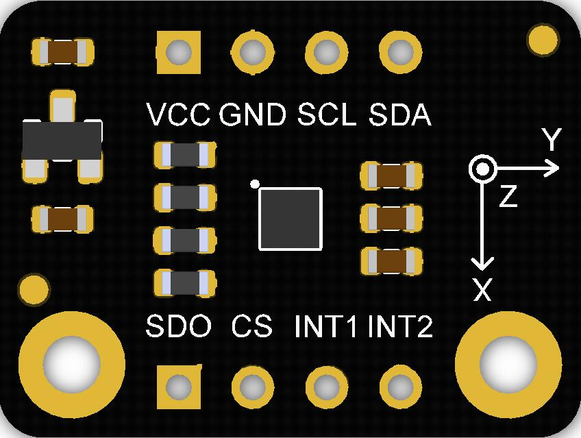
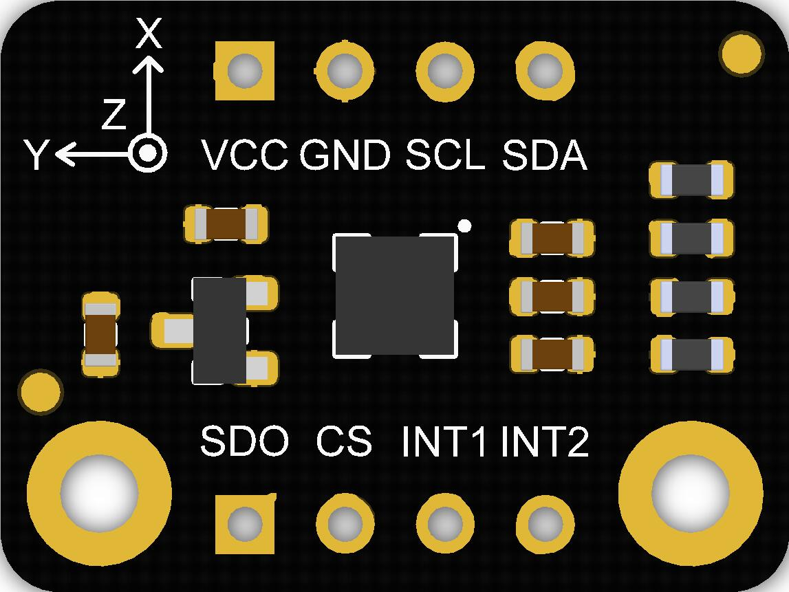
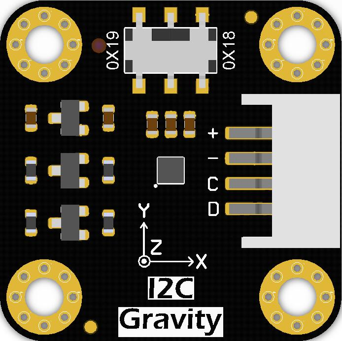
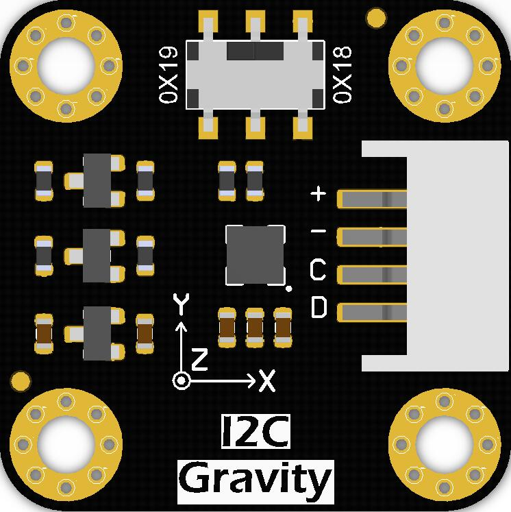

# DFRobot_LIS

* [English Version](./README.md)
  
H3LIS200DL是一款低功耗、高性能的3轴线性加速度计
属于“纳米”家族，具有数字I2C/SPI
串行接口标准输出。
该设备具有超低功耗运行特点
模式允许先进的节能和
智能sleep-to-wakeup功能。
H3LIS200DL有动态用户可选择的全量程±100g/±200g，是
能够测量加速度与输出
数据速率从0.5 Hz到1 kHz。
H3LIS200DL有一个小薄型
塑料地网阵列包(LGA)，是
保证在较长的时间内运行
温度范围:-40℃~ +85℃。

LIS331HH是一种超低功耗的高功率
性能高全尺寸三轴线性
加速度计属于“纳米”家族，具有
数字I2C/SPI串行接口标准输出。
该设备具有超低功耗运行特点
模式允许先进的节能和
智能睡眠唤醒功能。
LIS331HH具有动态用户选择功能
全量程±6g/±12g/±24g
测量加速度与输出数据速率
从0.5 Hz到1 kHz。自测能力
允许用户检查功能

IIS2DLPC是一款超低功耗高性能产品
带有数字I²C/SPI的三轴线性加速度计
输出接口，利用了健壮的和
已采用成熟的制造工艺
微机械加速度计的生产。
IIS2DLPC具有用户可选择的完整规模
±2g/±4g/±8g/±16g，可测量
输出数据速率从1.6 Hz到
1600 Hz。

LIS2DW12是一款超低功率高性能三轴线性
加速度计属于“femto”家族，利用了强大的和
成熟的制造工艺已用于生产微加工
加速度计。
LIS2DW12有用户可选择的±2g/±4g/±8g/±16g的全刻度，并能够
测量输出数据速率从1.6 Hz到1600hz的加速度。

LIS2DH12是一款超低功率高性能三轴线性
加速度计属于“femto”家族，利用了强大的和
成熟的制造工艺已用于生产微加工
加速度计。
LIS2DH12有用户可选择的±2g/±4g/±8g/±16g的全刻度

CHIP                | Work Well    | Work Wrong  | Remarks
------------------  | :----------: | :---------- | -----
H3LIS200DL          |      √       |              |             
LIS331HH            |      √       |              |  
LIS2DW12            |      √       |              |             
IIS2DLPC            |      √       |              |        
IIS2DH12            |      √       |              |       








## Product Link(https://www.dfrobot.com)
    SKU:SEN0405
    SKU:SEN0407
    SKU:SEN0408
    SKU:SEN0409
    SKU:SEN0411
    SKU:SEN0412
    SKU:SEN0224

## Table of Contents

  * [概述](#概述)
  * [库安装](#库安装)
  * [Method_H3LIS200DL_LIS331HH](#Method_H3LIS200DL_LIS331HH)
  * [Method_LIS2DW12_IIS2DLPC](#Method_LIS2DW12_IIS2DLPC)
  * [Method_LIS2DH12](#Method_LIS2DH12)
  * [兼容性](#兼容性)
  * [历史](#历史)
  * [创作者](#创作者)

## 概述

提供一个Arduino库，通过读取LIS数据获得三轴加速度。  

## 库安装

要使用这个库，首先将库下载到Raspberry Pi，然后打开例程文件夹。要执行一个例程demox.py，请在命令行中输入python demox.py。例如，要执行control_led.py例程，你需要输入:
```
cd DFRobot_LIS/python/raspberry/examples/LIS331HH/get_acceleration
python get_acceleration.py
```


## Method_H3LIS200DL_LIS331HH
```python
  
  def begin(self)
  '''
    @brief 初始化函数
    @return return True(成功)/False(失败)
  '''

  def get_id(self)
  '''
    @brief 获取芯片ID
    @return 8位连续数据
  '''  
  
  def set_range(self,range_r)
  '''
    @brief 设置测量范围
    @param range 范围(g)
    @n             H3LIS200DL_100G = 100 #±100G
    @n             H3LIS200DL_200G = 200 #±200G
    @n             LIS331HH_6G     #±6G
    @n             LIS331HH_12G    #±12G
    @n             LIS331HH_24G    #±24G
  '''  
  
  def set_acquire_rate(self, rate)
  '''
    @brief 设置数据速率
    @param rate 速率(HZ)
    @n             POWERDOWN_0HZ   
    @n             LOWPOWER_HALFHZ 
    @n             LOWPOWER_1HZ    
    @n             LOWPOWER_2HZ 
    @n             LOWPOWER_5HZ
    @n             LOWPOWER_10HZ 
    @n             NORMAL_50HZ
    @n             NORMAL_100HZ 
    @n             NORMAL_400HZ 
    @n             NORMAL_1000HZ 
  '''  
  
  def set_int1_th(self,threshold)
  '''
    @brief 设置“中断源1”的中断产生阈值 
    @param threshold 阈值(g)
  '''  
  
  def set_int2_th(self,threshold)
  '''
    @brief 设置“中断源2”的中断产生阈值  
    @param threshold 阈值(g)
  '''
  
  def enable_int_event(self,source,event)
  '''
    @brief 中断配置
    @source 中断引脚选择
    @n         INT_1 #中断焊盘1
    @n         INT_2 #中断焊盘2
    @param event 中断事件选择
    @n         X_LOWERTHAN_TH   #x方向的加速度小于阈值  
    @n         X_HIGHERTHAN_TH  #x方向的加速度大于阈值  
    @n         Y_LOWERTHAN_TH   #y方向的加速度小于阈值  
    @n         Y_HIGHERTHAN_TH  #y方向的加速度大于阈值  
    @n         Z_LOWERTHAN_TH   #z方向的加速度小于阈值  
    @n         Z_HIGHERTHAN_TH  #z方向的加速度大于阈值  
    @n         EVENT_ERROR      #没有事件>
  '''  
  
  def get_int1_event(self,event)
  '''
    @brief 检查中断1中是否产生中断事件'event' 
    @param event Interrupt event
    @n     X_LOWERTHAN_TH   #x方向的加速度小于阈值
    @n     X_HIGHERTHAN_TH  #x方向的加速度大于阈值
    @n     Y_LOWERTHAN_TH   #y方向的加速度小于阈值
    @n     Y_HIGHERTHAN_TH  #y方向的加速度大于阈值
    @n     Z_LOWERTHAN_TH   #z方向的加速度小于阈值
    @n     Z_HIGHERTHAN_TH  #z方向的加速度大于阈值
    @n     EVENT_ERROR      #没有事件
    @return True(事件产生)/False(事件没有产生)
  '''       
  
  def get_int2_event(self,source)
  '''
    @brief 检查中断2中是否产生中断事件'event'  
    @param event 中断事件
    @n         X_LOWERTHAN_TH   #x方向的加速度小于阈值
    @n         X_HIGHERTHAN_TH  #x方向的加速度大于阈值
    @n         Y_LOWERTHAN_TH   #y方向的加速度小于阈值
    @n         Y_HIGHERTHAN_TH  #y方向的加速度大于阈值
    @n         Z_LOWERTHAN_TH   #z方向的加速度小于阈值  
    @n         Z_HIGHERTHAN_TH  #z方向的加速度大于阈值
    @n         EVENT_ERROR       #没有事件
    @return True(事件产生)/False(事件没有产生)
  '''
  
  def enable_sleep(self, enable)
  '''
    @brief 开启睡眠唤醒功能
    @param enable True(使能)/False(失能))
  '''
  
  def set_filter_mode(self,mode)
  '''
    @brief 设置数据过滤模式
    @param mode 四个模式
    @n            CUTOFF_MODE1 = 0
    @n            CUTOFF_MODE2 = 1
    @n            CUTOFF_MODE3 = 2
    @n            CUTOFF_MODE4 = 3
    @n eg：选择50HZ的“eCutOffMode1”，过滤频率为1HZ  
    @n                        高通滤波器截止频率配置  
    @n|--------------------------------------------------------------------------------------------------------|
    @n|                |    ft [Hz]      |        ft [Hz]       |       ft [Hz]        |        ft [Hz]        |
    @n|   mode         |Data rate = 50 Hz|   Data rate = 100 Hz |  Data rate = 400 Hz  |   Data rate = 1000 Hz |
    @n|--------------------------------------------------------------------------------------------------------|
    @n|  CUTOFF_MODE1  |     1           |         2            |            8         |             20        |
    @n|--------------------------------------------------------------------------------------------------------|
    @n|  CUTOFF_MODE2  |    0.5          |         1            |            4         |             10        |
    @n|--------------------------------------------------------------------------------------------------------|
    @n|  CUTOFF_MODE3  |    0.25         |         0.5          |            2         |             5         |
    @n|--------------------------------------------------------------------------------------------------------|
    @n|  CUTOFF_MODE4  |    0.125        |         0.25         |            1         |             2.5       |
    @n|--------------------------------------------------------------------------------------------------------|
  '''  
  
  def read_acce_xyz(self)
  '''
    @brief 求xyz三个方向上的加速度  
    @return 三轴加速度 
  '''

```

## Method_LIS2DW12_IIS2DLPC
```python
  def begin(self)
  '''
    @brief 初始化函数
    @return True(成功)/Fasle(失败)
  '''
  
  def get_id(self)
  '''
    @brief 获取芯片ID
    @return 8位连续数据
  '''  
 
  def soft_reset(self)
  '''
    @brief 软件复位将所有寄存器的值恢复为默认值
  ''' 
  
  def set_range(self,range_r)
  '''
    @brief 设置测量范围
    @param range 范围(g)
    @n             RANGE_2G     #±2g
    @n             RANGE_4G     #±4g
    @n             RANGE_8G     #±8g
    @n             RANGE_16G    #±16g
  '''  
  
  def contin_refresh(self,enable)
  '''
    @brief 选择是否让芯片持续收集数据  
    @param enable  true(持续的更新)/false( 输出寄存器直到读取MSB和LSB时才更新  )
  '''
  
  def set_filter_path(self,path)
  '''
    @brief 设置滤波处理模式
    @param path 滤波方式
    @n            LPF          #低通滤波
    @n            HPF          #高通滤波
  '''
  
  def set_filter_bandwidth(self,bw)
  '''
    @brief 设置数据带宽
    @param bw 带宽
    @n            RATE_DIV_2   #RATE/2 (up to RATE = 800 Hz, 400 Hz when RATE = 1600 Hz)
    @n            RATE_DIV_4   #RATE/4 (高功率/低功率)
    @n            RATE_DIV_10  #RATE/10 (HP/LP)
    @n            RATE_DIV_20  #RATE/20 (HP/LP)
  '''

  def set_power_mode(self,mode)
  '''
    @brief 设置电源模式
    @param mode 模式有16种电源模式可供选择
    @n           HIGH_PERFORMANCE_14BIT          #高性能模式
    @n           CONT_LOWPWR4_14BIT              #连续测量，低功耗模式4(12位分辨率)  
    @n           CONT_LOWPWR3_14BIT              #连续测量，低功耗模式3(12位分辨率)  
    @n           CONT_LOWPWR2_14BIT              #连续测量，低功耗模式2(12位分辨率)  
    @n           CONT_LOWPWR1_12BIT              #连续测量，低功耗模式1(12位分辨率)  
    @n           SING_LELOWPWR4_14BIT            #单数据按需转换模式，低功耗模式4(12位分辨率)  
    @n           SING_LELOWPWR3_14BIT            #单数据按需转换模式，低功耗模式3(12位分辨率)  
    @n           SING_LELOWPWR2_14BIT            #单数据按需转换模式，低功耗模式2(12位分辨率)  
    @n           SING_LELOWPWR1_12BIT            #单数据按需转换模式，低功耗模式1(12位分辨率)  
    @n           HIGHP_ERFORMANCELOW_NOISE_14BIT #高性能模式,低噪声启用
    @n           CONT_LOWPWRLOWNOISE4_14BIT      #连续测量，低功耗模式4(14位分辨率，低噪声启用)  
    @n           CONT_LOWPWRLOWNOISE3_14BIT      #连续测量，低功耗模式3(14位分辨率，低噪声启用)  
    @n           CONT_LOWPWRLOWNOISE2_14BIT      #连续测量，低功耗模式2(14位分辨率，低噪声启用)  
    @n           CONT_LOWPWRLOWNOISE1_12BIT      #连续测量，低功耗模式1(14位分辨率，低噪声启用)  
    @n           SINGLE_LOWPWRLOWNOISE4_14BIT    #单数据转换按需模式，低功耗模式4(14位分辨率)，低噪音启用  
    @n           SINGLE_LOWPWRLOWNOISE3_14BIT    #单数据转换按需模式，低功耗模式3(14位分辨率)，低噪音启用  
    @n           SINGLE_LOWPWRLOWNOISE2_14BIT    #单数据转换按需模式，低功耗模式2(14位分辨率)，低噪音启用  
    @n           SINGLE_LOWPWRLOWNOISE1_12BIT    #单数据转换按需模式，低功耗模式1(12位分辨率)，低噪音启用  
  '''  
  
  def set_data_rate(self, rate):
  '''
    @brief 设置数据采集速率
    @param rate 速率
    @n             RATE_OFF          
    @n             RATE_1HZ6         
    @n             RATE_12HZ5        
    @n             RATE_25HZ         
    @n             RATE_50HZ         
    @n             RATE_100HZ        
    @n             RATE_200HZ        
    @n             RATE_400HZ        
    @n             RATE_800HZ        
    @n             RATE_1600HZ       
    @n             SETSWTRIG        
  '''  
  
  def set_free_fall_dur(self,dur):
  '''
    @brief 设置自由落体时间，或自由落体样品的数量。 在测量中，除非样品足够多，否则不能将其确定为自由落体事件
    @param dur 时间范围:0 ~ 31
    @n time = dur * (1/rate)(unit:s)
    @n|                                               这是一个参数和时间之间线性关系的例子                                      |
    @n|------------------------------------------------------------------------------------------------------------------------|
    @n|                |                     |                          |                          |                           |
    @n|  Data rate     |       25 Hz         |         100 Hz           |          400 Hz          |         = 800 Hz          |
    @n|------------------------------------------------------------------------------------------------------------------------|
    @n|   time         |dur*(1s/25)= dur*40ms|  dur*(1s/100)= dur*10ms  |  dur*(1s/400)= dur*2.5ms |  dur*(1s/800)= dur*1.25ms |
    @n|------------------------------------------------------------------------------------------------------------------------|
  ''' 
  
  def set_int1_event(self,event)
  '''
    @brief 设置int1引脚的中断源
    @param event  几个中断事件，设置后，当一个事件生成时，一个级别转换将在int1引脚上生成  
    @n          DOUBLE_TAP    #双击事件
    @n          FREEFALL      #自由落体事件
    @n          WAKEUP        #唤醒时间
    @n          SINGLE_TAP    #单击事件
    @n          IA6D          #改变面朝上/下/左/右/前/后状态的事件  
  '''  
  
  def set_wakeup_dur(self,dur)
  '''
    @brief 设置唤醒时间，当在setActMode()函数中使用eDetectAct的检测方式时，芯片被唤醒后会有一段时间
    @n 以正常速率采集数据。 然后芯片将继续休眠，以12.5hz的频率收集数据。
    @param dur  时间范围:0 ~ 3
    @n time = dur * (1/rate)(unit:s)
    @n|                                      这是一个参数和时间之间线性关系的例子                                               |
    @n|------------------------------------------------------------------------------------------------------------------------|
    @n|                |                     |                          |                          |                           |
    @n|  Data rate     |       25 Hz         |         100 Hz           |          400 Hz          |         = 800 Hz          |
    @n|------------------------------------------------------------------------------------------------------------------------|
    @n|   time         |dur*(1s/25)= dur*40ms|  dur*(1s/100)= dur*10ms  |  dur*(1s/400)= dur*2.5ms |  dur*(1s/800)= dur*1.25ms |
    @n|------------------------------------------------------------------------------------------------------------------------|
  '''
  
  def set_act_mode(self,mode)
  '''
    @brief 设置运动检测模式，第一模式不会检测模块是否在运动; 第二次，设置好后，以较低的频率测量数据，
    @n 节省消耗，检测到运动后恢复正常; 第三种只能检测模块是否处于睡眠状态。
    @param mode Motion detection mode
    @n            NO_DETECTION         #没有检测
    @n            DETECT_ACT           #检测移动，芯片在低功耗模式下自动切换到12.5 Hz频率  
    @n            DETECT_STATMOTION    #检测运动，芯片检测加速度低于固定阈值，但不会改变速率或工作模式  
  '''
  
  def set_wakeup_threshold(self,th)
  '''
    @brief 设置唤醒阈值，当某一方向的加速度大于该值时，触发唤醒事件  
    @param th 阈值，单位:mg，数值在测量范围内  
  '''  
  
  def enable_tap_detection_on_z(self, enable)
  '''
    @brief 设置为检测Z方向的点击事件
    @param enable Ture(启用点击检测)\False(禁用点击检测)
  '''
  
  def enable_tap_detection_on_y(self, enable)
  '''
    @brief 设置为检测Y方向上的点击事件
    @param enable Ture(启用点击检测)\False(禁用点击检测)
  '''
  
  def enable_tap_detection_on_x(self, enable)
  '''
    @brief 设置为检测X方向上的点击事件
    @param enable True(启用点击检测)\False(禁用点击检测)
  '''  
  
  def set_tap_threshold_on_x(self,th)
  '''
    @brief 设置X方向的点击阈值
    @param th 阈值(g)，只能在±2g范围内使用
  '''
  
  def set_tap_threshold_on_y(self,th)
  '''
    @brief 设置Y方向的点击阈值
    @param th 阈值(g)，只能在±2g范围内使用  
  '''  
  
  def set_tap_threshold_on_z(self,th)
  '''
    @brief 设置Z方向的点击阈值
    @param th 阈值(g)，只能在±2g范围内使用
  '''  
  
  def set_tap_dur(self,dur)
  '''
    @brief 双点识别的最大时间间隔的持续时间。 当双击识别被启用，这个寄存器表示两个之间的最大时间  
    @n 连续检测轻击以确定双轻击事件。  
    @param dur  时间范围:0 ~ 15
    @n time = dur * (1/rate)(unit:s)
    @n|                                   这是一个参数和时间之间线性关系的例子                                                  |
    @n|------------------------------------------------------------------------------------------------------------------------|
    @n|                |                     |                          |                          |                           |
    @n|  Data rate     |       25 Hz         |         100 Hz           |          400 Hz          |         = 800 Hz          |
    @n|------------------------------------------------------------------------------------------------------------------------|
    @n|   time         |dur*(1s/25)= dur*40ms|  dur*(1s/100)= dur*10ms  |  dur*(1s/400)= dur*2.5ms |  dur*(1s/800)= dur*1.25ms |
    @n|------------------------------------------------------------------------------------------------------------------------|
  '''
  
  def set_tap_mode(self,mode)
  '''
    @brief 设置点击检测模式，检测单点或同时检测单点和双点  
    @param mode  点击触发模式
    @n                 ONLY_SINGLE        #检测单击
    @n                 BOTH_SINGLE_DOUBLE #检测单击和双击
  '''
  
  def set_6d_threshold(self,degree)
  '''
    @brief 设置4D/6D阈值，当旋转阈值超过指定角度时，将发生方向变化事件。  
    @param 角度     DEGREES_80   #80°
    @n              DEGREES_70   #70°
    @n              DEGREES_60   #60°
    @n              DEGREES_50   #50°
  '''  
  
  def set_int2_event(self,event)
  '''
    @brief 选择在int2引脚上生成的中断事件  
    @param event  几个中断事件，设置后，当一个事件生成时，一个级别转换将在int2引脚上生成  
    @n            SLEEP_CHANGE  #在INT2焊点上使能SLEEP STATE路由
    @n            SLEEP_STATE   #睡眠改变状态路由到INT2焊点
  '''
  
  def read_acc_x(self)
  '''
    @brief 读取x方向上的加速度
    @return 加速度数据来自x(mg)，测量范围为±2g，±4g，±8g或±16g，由setRange()函数设置  
  '''
  
  def read_acc_y(self)
  '''
    @brief 读取y方向上的加速度
    @return  加速度数据来自y(mg)，测量范围为±2g，±4g，±8g或±16g，由setRange()函数设置  
  '''
  
  def read_acc_z(self)
  '''
    @brief 读取z方向上的加速度
    @return 加速度数据来自z(mg)，测量范围为±2g，±4g，±8g或±16g，由setRange()函数设置  
  '''
  
  def act_detected(self)
  '''
    @brief 检测是否产生运动
    @return True(运动生成)/False(不动)
  '''    
  
  def free_fall_detected(self)
  '''
    @brief 自由落体检测
    @return True(检测到自由落体)/False(未检测到自由落体)  
  '''  
  
  def ori_change_detected(self)
  '''
    @brief 当芯片面朝上/下/左/右/前/后(即6D)时，检测芯片方向是否改变  
    @return True(检测到位置变化)/False(未检测到事件)  
  '''    
  
  def get_oriention(self)
  '''
    @brief 只有在6D(朝上/朝下/左/右/向前/向后)状态下，函数才能得到传感器相对于正z轴的方向        
    @return      X_DOWN   #X现在是向下的
    @n           X_UP     #X现在是向上的
    @n           Y_DOWN   #Y现在是向上的
    @n           Y_UP     #Y现在是向下的
    @n           Z_DOWN   #Z现在是向上的
    @n           Z_UP     #Z现在是向下的
  '''   
  
  def tap_detect(self)
  '''
    @brief 轻拍检测，可以检测是双拍还是单拍  
    @return   S_TAP       #单击
    @n          D_TAP       #双击
    @n          NO_TAP,     #没有敲击触发
  '''
  
  def get_tap_direction(self)
  '''
    @brief 敲击方向信号源检测
    @return     DIR_X_UP   #在X的正方向检测到敲击
    @n          DIR_X_DOWN #在X的负方向检测到敲击 
    @n          DIR_Y_UP   #在Y的正方向检测到敲击
    @n          DIR_Y_DOWN #在Y的负方向检测到敲击
    @n          DIR_Z_UP   #在Z的正方向检测到敲击
    @n          DIR_Z_DOWN #在Z的负方向检测到敲击
  '''
   
  def get_wake_up_dir(self)
  '''
    @brief 唤醒运动方向检测
    @return    DIR_X  #芯片被X方向的运动唤醒  
    @n         DIR_Y  #芯片被Y方向的运动唤醒  
    @n         DIR_Z  #芯片被Z方向的运动唤醒  
  '''
  
  def demand_data(self)
  '''
    @brief 在单数据转换按需模式下，请求测量  
  '''
```
## Method_LIS2DH12
```python
def begin(self)
    '''!
      @brief 初始化函数
      @return true(成功)/false(失败)
    '''

  def set_range(self, range)
    '''!
      @brief 设置测量范围
      @param range 范围(g)
      @n            LIS2DH12_2g, //2g
      @n            LIS2DH12_4g, //4g
      @n            LIS2DH12_8g, //8g
      @n            LIS2DH12_16g, //16g
    '''

  def get_id(self)
    '''!
      @brief 获取芯片ID
      @return 8位连续数据
    '''
  
  def set_acquire_rate(self, rate)
    '''!
      @brief 设置数据测量速率
      @param rate 速率(HZ)
      @n            POWERDOWN_0HZ 
      @n            LOWPOWER_1Hz 
      @n            LOWPOWER_10Hz 
      @n            LOWPOWER_25Hz 
      @n            LOWPOWER_50Hz 
      @n            LOWPOWER_100Hz
      @n            LOWPOWER_200Hz
      @n            LOWPOWER_400Hz
    '''
  
  def set_int1_th(self, threshold)
    '''!
      @brief 设置中断源1中断的阈值  
      @param threshold 阈值在测量范围内(unit:g)
    '''

  def set_int2_th(self, threshold)
    '''!
      @brief 设置中断源2中断的阈值  
      @param threshold 阈值在测量范围内(unit:g)
    '''

  def enable_int_event(self, source, event)
    '''!
      @brief 使能中断
      @param source 中断引脚选择
      @n        INT_1 = 0,/<int1 >/
      @n        INT_2,/<int2>/
      @param event 中断选择
      @n           X_LOWERTHAN_TH ,/<x方向上的加速度小于阈值>/
      @n           X_HIGHERTHAN_TH ,/<x方向上的加速度小于阈值>/
      @n           Y_LOWERTHAN_TH,/<x方向上的加速度小于阈值>/
      @n           Y_HIGHERTHAN_TH,/<x方向上的加速度小于阈值>/
      @n           Z_LOWERTHAN_TH,/<x方向上的加速度小于阈值>/
      @n           Z_HIGHERTHAN_TH,/<x方向上的加速度小于阈值>/
    '''

  def get_int1_event(self, event)
    '''!
      @brief 检查中断1中是否产生中断事件'event'  
      @param event 中断事件
      @n           X_LOWERTHAN_TH ,/<x方向上的加速度小于阈值>/
      @n           X_HIGHERTHAN_TH ,/<x方向上的加速度大于阈值>/
      @n           Y_LOWERTHAN_TH,/<y方向上的加速度小于阈值>/
      @n           Y_HIGHERTHAN_TH,/<y方向上的加速度大于阈值>/
      @n           Z_LOWERTHAN_TH,/<z方向上的加速度小于阈值>/
      @n           Z_HIGHERTHAN_TH,/<z方向上的加速度大于阈值>/
      @return true 产生/false 没有产生
    '''

  def get_int2_event(self, event)
    '''!
      @brief 检查中断2中是否产生中断事件'event'  
      @param event 中断事件
      @n             X_LOWERTHAN_TH ,/<x方向上的加速度小于阈值>/
      @n             X_HIGHERTHAN_TH ,/<x方向上的加速度大于阈值>/
      @n             Y_LOWERTHAN_TH,/<y方向上的加速度小于阈值>/
      @n             Y_HIGHERTHAN_TH,/<y方向上的加速度大于阈值>/
      @n             Z_LOWERTHAN_TH,/<z方向上的加速度小于阈值>/
      @n             Z_HIGHERTHAN_TH,/<z方向上的加速度大于阈值>/
      @return true 产生/false 没有产生
    ''' 

  def read_acc_x(self)
    '''!
      @brief 获取x方向的加速度
      @return 从x加速度 (unit:g), 测量范围为2g或16g，由setRange()函数设定。 
    '''
  def read_acc_y(self)
    '''!
      @brief 获取y方向的加速度
      @return 从y加速度 (unit:g), 测量范围为2g或16g，由setRange()函数设定。 
    '''

  def read_acc_z(self)
    '''!
      @brief 获取z方向的加速度
      @return 从z加速度 (unit:g), 测量范围为2g或16g，由setRange()函数设定。  
    '''
```
## Compatibility

MCU                | Work Well    | Work Wrong   | Untested    | Remarks
------------------ | :----------: | :----------: | :---------: | -----
Raspberry Pi              |      √         |            |             | 


## 兼容性

- 2021/2/1 -1.0.0 版本
- 2021/1/6 -1.0.1 版本

## 创作者

Written by(li.feng@dfrobot.com,jie,tang@dfrobot.com), 2021. (Welcome to our [website](https://www.dfrobot.com/))
